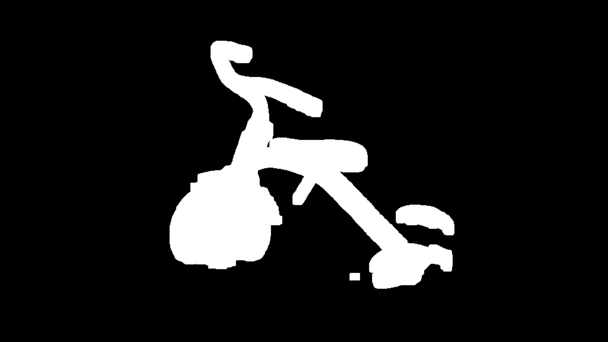
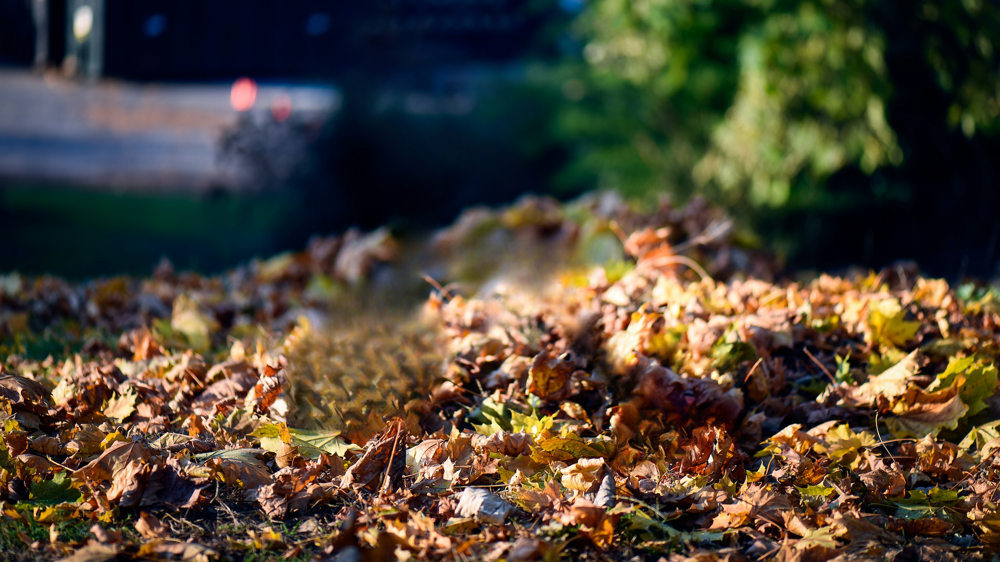

# simple-lama-inpainting

<div align="center">
Simple script for LaMa[1] inpainting using Hugging Face Hub.<br>
</div>

## Description

This project provides a simple implementation of the LaMa (Large Mask) inpainting model. It uses the Hugging Face Hub to download the pre-trained model and performs inpainting on images with given masks.

While this project may not produce perfect inpainting results, it provides a good starting point for further refinement. Here's a suggested workflow:

1. Generate a mask using the [okaris/grounded-segmentation](https://github.com/okaris/grounded-segmentation) project.
2. Use this simple-lama-inpainting project to perform initial inpainting.
3. Further refine the inpainted result using a diffusion model of your choice.

This workflow can help achieve more realistic and context-aware inpainting results.

## Example

| Original Image | Mask | Inpainted Result |
|----------------|------|------------------|
|  |  |  |

In this example, we remove the tricycle from the image using the provided mask, and the LaMa model inpaints the area seamlessly.

Photo credit: Photo by <a href="https://unsplash.com/@dolfoto?utm_content=creditCopyText&utm_medium=referral&utm_source=unsplash">Rodolfo Mari</a> on <a href="https://unsplash.com/photos/red-radio-flyer-trike-on-brown-dried-leaves-2sNnC0zDOBQ?utm_content=creditCopyText&utm_medium=referral&utm_source=unsplash">Unsplash</a>

## Installation

1. Clone the repository:
````bash
git clone https://github.com/okaris/simple-lama.git
cd simple-lama
````

2. Set up a virtual environment (optional but recommended):
````bash
python -m venv venv
source venv/bin/activate  # On Windows, use `venv\Scripts\activate`
````

3. Install the required dependencies:
````bash
pip install -r requirements.txt
````

## Usage

### Command Line Interface

You can use the script directly from the command line:

````bash
python simple_lama.py --image_path path/to/image.png --mask_path path/to/mask.png --output path/to/output.png
````

### Integration in Your Code

You can also use the `SimpleLama` class in your Python code:

```python
from simple_lama import SimpleLama
from PIL import Image

lama = SimpleLama()

image = Image.open("path/to/image.png")
mask = Image.open("path/to/mask.png").convert('L')

result = lama(image, mask)
result.save("inpainted.png")
````

## Input Formats

- Image: `PIL.Image.Image` or `numpy.ndarray` (3 channel input image)
- Mask: `PIL.Image.Image` or `numpy.ndarray` (1 channel binary mask image where pixels with 255 will be inpainted)

## Output Format

- `PIL.Image.Image`

## Notes

- The script automatically uses CUDA if available, otherwise it falls back to CPU.
- The mask is expected to be a binary image where pixels with value 255 indicate areas to be inpainted.

## Sources

[1] Suvorov, R., Logacheva, E., Mashikhin, A., Remizova, A., Ashukha, A., Silvestrov, A., Kong, N., Goka, H., Park, K., & Lempitsky, V. (2021). Resolution-robust Large Mask Inpainting with Fourier Convolutions. arXiv preprint arXiv:2109.07161.
[2] https://github.com/saic-mdal/lama
[3] https://github.com/Sanster/lama-cleaner
[4] https://github.com/enesmsahin/simple-lama-inpainting
